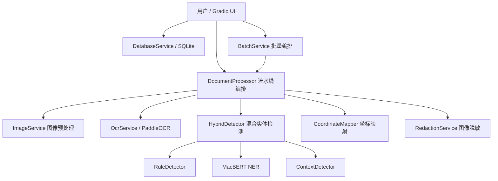
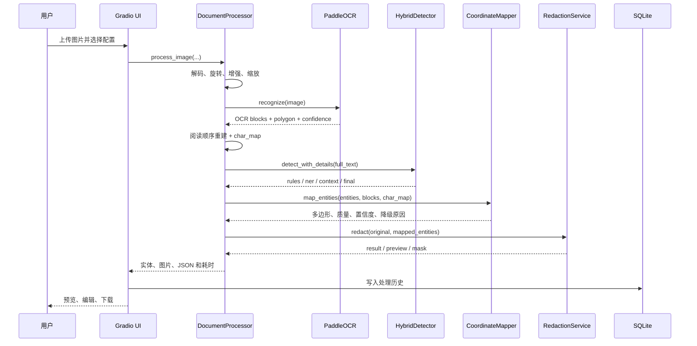

# pii-redactor 项目答辩与技术原理详解

本文面向课程设计、毕业设计或工程项目答辩，按照“项目要解决什么问题、为什么选择这些技术、系统如何实现、实验结果是否可信、还存在哪些不足”的逻辑，完整介绍 `pii-redactor`。

文中结论以当前仓库、配置和已有报告为准。涉及评测结果时，必须注意文本模型结果、图像端到端结果和后续坐标修复属于不同阶段，不能混为同一个实验。

## 1. 一分钟项目介绍

`pii-redactor` 是一个可完全本地运行的中文文档敏感信息检测与图像脱敏系统。用户可以上传扫描件、截图或输入纯文本，系统通过 PaddleOCR 提取图片文字，使用规则检测、上下文检测和微调后的 MacBERT NER 模型识别敏感实体，再把实体在文本中的字符位置映射回原始图片，最终生成黑框、马赛克或模糊处理后的图片、透明 Mask、实体明细和 JSON 报告。

项目重点不是简单调用一个 OCR 或一个大模型，而是打通以下完整工程链路：

```text
图片输入
  -> 图像规范化
  -> OCR 文字与文本块坐标
  -> 阅读顺序重建
  -> 多策略敏感实体检测
  -> 字符 span 到图像区域映射
  -> 可审计的脱敏输出
  -> 本地历史、批量导出和性能日志
```

项目采用本地部署，不需要把原始文档上传到第三方服务。它适合作为隐私保护工具的 MVP 和技术验证平台，但不能替代高风险业务中的人工隐私审核。

## 2. 研究背景与问题定义

### 2.1 背景

身份证明、快递单、聊天截图、表格和医疗材料中经常包含姓名、地址、电话、身份证号、邮箱、银行卡号等个人信息。直接分享这些图片会造成隐私泄露，而人工逐张查找和涂黑存在以下问题：

- 数据量大时处理效率低；
- 容易漏掉不显眼的敏感字段；
- 不同操作人员的遮挡标准不一致；
- 很难留下可追溯的检测与处理记录；
- 图片中的文字既有语义问题，也有几何定位问题。

### 2.2 项目要解决的核心问题

项目将任务定义为两个相互关联但不同的子问题：

1. **实体检测问题**：在 OCR 重建文本中确定哪些字符属于敏感信息，即预测实体类型和字符区间 `[start, end)`。
2. **图像定位问题**：把实体字符区间转换成原图上的一个或多个多边形，使遮挡区域完整覆盖真实文字墨迹。

前者属于 NLP 序列标注，后者属于 OCR 几何映射与计算机视觉问题。实体识别正确不等于图片遮挡一定完整，这也是本项目评测中最重要的认识。

### 2.3 设计目标

| 目标 | 项目实现 |
|---|---|
| 本地隐私保护 | 默认监听 `127.0.0.1`，模型、图片和数据库均保存在本机 |
| 多类型检测 | 规则、上下文与 MacBERT NER 互补 |
| 图片端到端处理 | OCR、实体检测、坐标映射和脱敏形成流水线 |
| 可人工干预 | UI 中可以关闭某个实体并重新生成脱敏图 |
| 可审计 | 保存来源、置信度、映射策略、降级原因、Mask 和 JSON |
| 可训练 | 提供数据准备、训练、评估、实验管理和最佳模型切换脚本 |
| 可验证 | 包含文本指标、图像指标、错误分析及自动化测试 |
| 可维护 | 服务层、UI、训练、评测和数据工具分层组织 |

## 3. 系统功能

当前 Gradio 应用包含六个页面：

| 页面 | 主要功能 |
|---|---|
| 图片脱敏 | 上传图片、选择实体类型和脱敏模式、查看实体框、下载结果/Mask/报告 |
| 文本检测 | 展示规则、NER、上下文和最终融合结果 |
| 批量处理 | 一次处理最多 20 张图片，单文件失败隔离，导出 ZIP/CSV/JSON |
| 历史记录 | 按文件名和实体类型查询 SQLite 记录，并支持删除 |
| 模型配置 | 查看模型来源、阈值并重新加载本地最佳模型 |
| 系统状态 | 查看 OCR、NER、数据库和运行环境状态 |

系统支持三种脱敏模式：

- **黑框**：将目标区域像素直接替换成固定颜色，是默认且更安全的方式；
- **马赛克**：先缩小区域再用最近邻插值放大，保留块状视觉轮廓；
- **模糊**：对区域执行高斯模糊，视觉更自然但存在恢复风险。

## 4. 总体架构

### 4.1 分层架构



### 4.2 模块职责

| 模块 | 职责 | 关键文件 |
|---|---|---|
| 应用入口 | 创建进程级服务实例、配置队列、启动本地服务 | `app.py` |
| UI | 构建六个 Tab 和回调，不承载核心算法 | `ui/` |
| 图像预处理 | 解码、EXIF 旋转、颜色统一、暗图增强、缩放 | `services/image_service.py` |
| OCR | PaddleOCR 延迟加载、兼容结果解析、缓存、阅读顺序重建 | `services/ocr_service.py` |
| 实体检测 | 规则、NER、上下文检测与冲突消解 | `services/*_detector.py` |
| 坐标映射 | 字符 span 到倾斜 OCR 多边形的映射与安全降级 | `services/coordinate_mapper.py`、`utils/geometry.py` |
| 脱敏 | 生成黑框/马赛克/模糊结果、预览和 Mask | `services/redaction_service.py` |
| 流水线 | 串联各阶段并记录耗时、警告和报告 | `services/document_processor.py` |
| 数据库 | SQLite 历史、文件哈希去重和检索 | `services/database_service.py` |
| 批量处理 | 文件级故障隔离及 ZIP/CSV/JSON 导出 | `services/batch_service.py` |
| 训练 | BIO 对齐、PyTorch 训练、评估和推理 | `training/` |
| 评测 | OCR、实体和图像框指标及错误可视化 | `evaluation/` |

### 4.3 为什么采用模块化流水线

如果把 OCR、NER、坐标处理和 UI 全写在一个回调中，会导致算法难以单测、模型重复加载、错误难以定位。当前架构让每个模块拥有明确输入输出：

- OCR 可以单独替换而不修改 NER；
- 规则可以单独新增而不重新训练模型；
- 坐标算法可以使用固定 OCR block 做回归测试；
- UI 只负责交互，不直接实现检测逻辑；
- `DocumentProcessor` 统一记录分阶段耗时和降级信息。

## 5. 端到端处理流程

### 5.1 图片处理时序



### 5.2 关键数据对象

OCR block 的核心结构如下：

```json
{
  "text": "联系人张三",
  "confidence": 0.98,
  "polygon": [[10, 20], [190, 18], [192, 58], [12, 60]],
  "block_index": 0
}
```

实体的核心结构如下：

```json
{
  "type": "person",
  "text": "张三",
  "start": 3,
  "end": 5,
  "confidence": 0.93,
  "source": "ner"
}
```

映射后会增加：

```json
{
  "boxes": [[[100, 15], [190, 14], [192, 62], [101, 63]]],
  "mapping_quality": "refined",
  "mapping_confidence": 0.81,
  "mapping_strategy": "component",
  "fallback_reason": null,
  "enabled": true
}
```

## 6. 图像预处理原理

`ImageService` 接受文件路径、PIL 图片或 NumPy 数组，并统一转换为可处理的 RGB 图像。

### 6.1 EXIF 方向校正

手机图片可能依靠 EXIF 元数据表示旋转方向，而像素本身没有旋转。系统使用 `ImageOps.exif_transpose` 把方向信息真正应用到像素，避免 OCR 坐标与显示方向不一致。

### 6.2 颜色与透明通道

- 灰度图转换为 RGB；
- RGBA 图片先与白色背景合成，避免透明区域在不同库中表现不一致；
- NumPy 输入可按 BGR 转 RGB，兼容 OpenCV 的默认颜色顺序。

### 6.3 暗图增强

系统计算灰度平均亮度。如果亮度低于 70，则执行自动对比度和轻度对比度增强。设计目标是改善暗图可读性，而不是对所有图片强制二值化，因为过度增强可能破坏细字体。

### 6.4 等比例缩放与坐标恢复

当图片最长边超过 `ocr.max_image_side=2400` 时，系统按比例缩小：

```text
r = min(1, max_side / max(width, height))
```

OCR 后使用：

```text
scale_x = original_width / processed_width
scale_y = original_height / processed_height
```

将 OCR 多边形放大回原图坐标。真正的脱敏始终应用在原始分辨率图片上，避免下载结果被降采样。

## 7. OCR 与阅读顺序重建

### 7.1 PaddleOCR 在项目中的作用

项目通过 PaddleOCR 3.7 的本地推理接口获得文字、识别置信度和四边形坐标。OCR 一般包含文本检测和文本识别两个阶段：

1. 文本检测器定位可能含文字的区域；
2. 文本识别器把区域图像转换成字符序列；
3. 方向模块处理部分旋转文本行。

本项目不重新训练 PaddleOCR，而是把它作为预训练视觉基础组件。系统代码负责输入规范化、版本结果兼容、坐标缩放、排序、缓存和错误降级。

### 7.2 延迟加载与单例复用

OCR 引擎首次真正识别时才加载，并通过线程锁保证进程内只初始化一次。这样可以避免每个 UI 回调重新占用大量内存，也能缩短应用构建阶段的阻塞时间。

### 7.3 有界内存缓存

缓存键由“处理后图片像素 + OCR 配置”计算 SHA-256 得到。当前缓存最多 32 条，TTL 为 600 秒，并采用 LRU 淘汰：

- 相同图片和配置可以直接复用 OCR blocks；
- 修改图片或配置会产生不同哈希；
- 缓存仅存在于进程内，退出应用即清除；
- 不再把完整 OCR 结果写入无界磁盘缓存，降低隐私残留风险。

### 7.4 阅读顺序重建

OCR 返回的 block 顺序不一定就是人类阅读顺序。系统先计算每个块高度的中位数，以 `0.6 × 中位高度` 作为近似行容差，再进行：

1. 按 y 和 x 初步排序；
2. 根据中心 y 坐标聚类到同一行；
3. 行内按 x 从左到右排序；
4. 行与行之间插入换行符。

同时构造 `char_map`，为重建文本中的每个字符记录：

```text
char_index -> block_index + offset_in_block
```

换行符没有对应 OCR block。这个映射是后续字符 span 返回图片坐标的基础。

## 8. 混合敏感实体检测

### 8.1 为什么不只使用一种方法

不同敏感信息具有不同统计性质：

- 手机号、身份证号和银行卡号格式稳定，规则精确且可解释；
- 姓名、地址和机构依赖上下文，单纯正则难以覆盖；
- OCR 可能插入空格、产生字符错误，需要规范化与容错；
- 单个模型可能产生幻检，而规则校验可以排除不合法号码。

因此系统使用“规则 + NER + 上下文”的混合方案。

### 8.2 规则检测原理

`RuleDetector` 使用正则表达式产生候选，并对关键类型执行语义校验。

| 类型 | 检测与校验方式 |
|---|---|
| 手机号 | 中国大陆号段正则，去除空格、连字符和 `+86` 后验证 |
| 身份证号 | 18 位格式、出生日期合法性、MOD 11-2 校验码 |
| 银行卡号 | 16 至 19 位数字及 Luhn 校验 |
| 邮箱 | 本地部分、`@`、域名和后缀正则 |
| 护照 | 护照格式候选并要求附近存在护照语境 |
| 车牌 | 省份简称、字母和号码组合 |
| IP | 正则候选后交给标准库 `ipaddress` 验证 |
| URL | 协议或 `www.` 开头并清理尾部标点 |
| QQ/微信/邮编 | 格式候选与附近关键词联合判断 |

#### 身份证 MOD 11-2

前 17 位分别乘以固定权重：

```text
(7, 9, 10, 5, 8, 4, 2, 1, 6, 3, 7, 9, 10, 5, 8, 4, 2)
```

求和后对 11 取余，再根据映射串 `10X98765432` 得到末位校验码。系统还会先验证身份证中的出生日期，减少随机 18 位数字的误报。

#### Luhn 算法

银行卡号从右侧按奇偶位置对部分数字乘 2，大于 9 时减 9，所有数字求和后满足：

```text
sum % 10 == 0
```

才视为有效候选。正则负责召回，校验算法负责精度。

### 8.3 MacBERT NER 原理

当前模型基于 `hfl/chinese-macbert-base`，并在项目数据上进行 token classification 微调。

#### Transformer 自注意力

对于输入表示矩阵 `X`，注意力层生成查询、键和值：

```text
Q = XW_Q
K = XW_K
V = XW_V
Attention(Q,K,V) = softmax(QK^T / sqrt(d_k))V
```

每个 token 可以根据上下文关注其它 token，因此模型能区分“张三”是姓名，还是某个无关字符串的一部分。多头注意力让不同子空间学习不同关系，再经过前馈网络、残差连接和层归一化形成深层上下文表示。

#### MacBERT 的特点

MacBERT 延续 BERT 的双向 Transformer 编码器，但预训练中的掩码纠错思路尽量使用与原词语义相关的替换词，而不是大量使用与自然句子不一致的 `[MASK]`。这种预训练方式更接近真实文本纠错和下游输入分布，适合中文理解任务。

项目使用的 base 配置为 12 层、隐藏维度 768、12 个注意力头。分类头对每个 token 输出 BIO 标签概率。

### 8.4 BIO 序列标注

当前分类标签为：

```text
O
B-PERSON  I-PERSON
B-ADDRESS I-ADDRESS
B-ORGANIZATION I-ORGANIZATION
```

- `B` 表示实体开始；
- `I` 表示实体内部；
- `O` 表示非实体。

例如：

```text
文本：联系人 张 三 住 在 北 京 市
标签：O O O B-PERSON I-PERSON O O B-ADDRESS I-ADDRESS I-ADDRESS
```

项目使用 fast tokenizer 的 `offset_mapping` 将字符级标注 `[start, end)` 对齐到 token。特殊 token 或 padding 的标签设为 `-100`，交叉熵计算时忽略。若实体被 `max_length` 截断，则不强行生成不完整监督标签。

虽然统一标签表还包含电话、身份证、邮箱、银行卡、护照和车牌，但当前 NER 分类头只直接学习 person、address 和 organization；格式型实体主要由规则模块处理。当前 v2 文本数据中实际评测类型为 person 和 address。

### 8.5 长文本滑动窗口

推理时 `max_length=256`，窗口步长重叠量为 64。tokenizer 返回多个重叠窗口，各窗口独立预测，最后按 `(type, start, end)` 去重并保留置信度较高的结果。这避免长文本尾部被简单截断。

### 8.6 上下文检测

`ContextDetector` 提供保守的补充能力：

- 根据“姓名、联系人、收件人”等关键词提取 2 至 4 个中文字符；
- 根据“地址、住址、收货地址”等关键词提取地址候选；
- 根据“学校、医院、公司”等后缀细化 organization 子类型；
- 将 NER 地址向后扩展到合理的行政区或门牌后缀。

上下文候选的置信度低于强规则和模型结果，目的是补充召回而不是覆盖高质量结果。

### 8.7 融合与冲突消解

所有候选首先规范为统一结构。如果类型、开始位置和结束位置完全一致，则合并 `sources` 并保留最大置信度。对于互相重叠的候选，系统按以下因素排序：

1. 实体类型优先级；
2. 校验是否通过；
3. 是否来自 NER；
4. 置信度；
5. 实体长度。

身份证和银行卡等强结构实体优先级最高。未经 NER 支持的姓名、地址和机构候选会降低优先级。最终采用高优先级候选，拒绝与已接收实体重叠的低优先级候选。

这种融合不是简单平均概率，而是可解释的候选级决策。

## 9. 字符坐标到图像坐标的映射

这是项目中最具工程挑战的部分。

### 9.1 问题来源

OCR 通常只返回整个文本行或文本块的四边形，不返回每个字符的准确边界。假设 OCR block 是“联系人张三13800138000”，NER 只识别“张三”，系统必须估计“张三”在整块中的局部位置。

直接按字符数平均切分存在明显误差：

- 中文、数字、大小写字母和标点宽度不同；
- OCR 多边形可能倾斜；
- 字符间距并不均匀；
- OCR 文本可能与图像墨迹不完全一致；
- 姓名后紧跟数字时边界很难判断；
- 一个实体可能跨多个 OCR block。

### 9.2 span 定位

系统优先使用 `char_map`，把实体 `[start, end)` 对应到 block 内字符偏移。若无法直接对应，则依次尝试：

1. NFKC、标点、大小写和空白规范化后的唯一匹配；
2. 模糊字符串匹配；
3. 找不到时返回无框警告。

跨 block 实体会拆成多个局部部分，分别生成多个多边形。

### 9.3 字符视觉权重

系统不再假设每个字符等宽，而是设置近似视觉权重：

| 字符类型 | 权重 |
|---|---:|
| 中文、全角宽字符 | 1.00 |
| 大写字母 | 0.72 |
| 小写字母、数字 | 0.58 |
| 标点 | 0.35 |
| 普通空格 | 0.30 |

设整块字符权重为 `w_1 ... w_n`，实体对应字符范围为 `[s,e)`：

```text
start_ratio = sum(w_1 ... w_s) / sum(w_1 ... w_n)
end_ratio   = sum(w_1 ... w_e) / sum(w_1 ... w_n)
```

再沿倾斜四边形的上边和下边分别线性插值，得到局部四边形，而不是先把倾斜框转成普通矩形。

### 9.4 透视矫正

系统使用四点透视变换，把倾斜 OCR block 映射到水平矩形。变换矩阵 `H` 满足齐次坐标关系：

```text
p' ~ H p
```

矫正后的图像更适合做水平投影和连通域分析。系统根据边缘亮度判断背景明暗，再结合 Otsu 和自适应阈值提取前景墨迹。

### 9.5 墨迹投影修正

二值图在每个 x 位置统计前景像素数，得到垂直投影：

```text
P(x) = 该列前景像素数量
```

字符之间的空隙通常对应投影低谷。系统在加权估计边界附近搜索低谷，根据低谷强度调整实体起止位置。低谷不明显时不会盲目采用修正结果。

### 9.6 连通域修正

系统对二值图执行 8 邻域连通域分析，过滤面积和高度过小的噪声，再把距离较近的组件合并为墨迹组。

根据实体预计字符数，算法从初始框覆盖的组件开始向两侧扩展：

- 相邻间隙小于动态阈值时继续吸收；
- 达到预计组件数或遇到大间隙时停止；
- 使用 `component_match_ratio` 估计匹配可信度。

这能修复初始框只覆盖姓名部分笔画的问题，同时尽量避免把紧邻的电话号码全部纳入姓名框。

### 9.7 安全边距与覆盖检查

边距会随 OCR block 高度和映射置信度动态变化。严格模式下，低置信度框使用更大的水平边距。系统还检查：

- 框是否小于最小宽高；
- 框附近是否仍有未覆盖墨迹；
- 实际宽度与按字符权重估计宽度是否相差过大；
- 修正后宽度增长是否超过 `maximum_overcover_ratio=0.35`；
- 中文姓名后是否紧邻数字但缺少可靠边界。

### 9.8 低置信度整块降级

当前配置为：

```yaml
strategy: ink_refined
safety_mode: strict
minimum_mapping_confidence: 0.72
low_confidence_fallback: full_block
```

如果检测到边界不可靠、跨 block、模糊匹配、墨迹修正失败或可能覆盖不完整，严格模式会遮挡完整 OCR block。这样会牺牲一部分非敏感内容，但更符合隐私脱敏“漏遮风险高于多遮风险”的目标。

映射结果会保留 `mapping_strategy`、`mapping_confidence`、`fallback_reason` 和 `mapping_steps`，方便答辩展示算法为什么做出降级决定。

## 10. 图像脱敏原理

### 10.1 Mask

系统为所有启用实体的多边形创建单通道 Mask：

```text
目标区域像素 = 255
其它区域像素 = 0
```

Mask 可以用于审计、后续合成和判断是否存在遗漏区域。

### 10.2 黑框

黑框模式直接把 Mask 内像素替换为 `(0,0,0)`。只要区域完整覆盖，该模式不会保留原文字纹理，因此比模糊和马赛克更适合高风险数据。

### 10.3 马赛克

目标区域先按块大小缩小，再用最近邻插值放大：

```text
crop -> BOX downsample -> NEAREST upsample
```

相邻像素被合并成色块，但大体轮廓仍可能存在。块大小越大，信息损失越多，视觉破坏也越明显。

### 10.4 高斯模糊

高斯模糊相当于用二维高斯核对局部区域卷积：

```text
G(x,y) = 1/(2*pi*sigma^2) * exp(-(x^2+y^2)/(2*sigma^2))
```

它使高频边缘变平滑，但不是密码学意义上的不可逆匿名化。已知模糊核、低模糊强度或结合上下文时，仍可能推断原始内容。

### 10.5 非破坏式输出

系统不会覆盖原图，而是生成：

- 脱敏结果图；
- 带红框和类型文字的预览图；
- 单通道 Mask；
- JSON 处理报告。

文件名包含安全化后的原始 stem 和随机 token，减少并发覆盖风险。

## 11. 数据集与数据治理

### 11.1 文本数据

当前数据检查报告记录：

| 项目 | 数量 |
|---|---:|
| 原始文本记录 | 40,000 |
| 原始实体 | 111,965 |
| 无效实体 | 0 |
| 重叠实体对 | 0 |
| 训练集 | 31,864 |
| 验证集 | 4,029 |
| 固定测试集 | 4,107 |

数据来自 formal 和 chat 两类文本。准备脚本执行：

1. JSONL 解析和字段统一；
2. 实体别名映射；
3. `text[start:end] == entity.text` 校验；
4. 文本指纹去重；
5. 冲突标注报告；
6. 按模板指纹分组；
7. 固定随机种子划分 train/validation/test；
8. 生成 split manifest 和统计报告。

模板分组可以减少同一模板轻微替换后同时出现在训练集和测试集造成的数据泄漏。

### 11.2 图像数据

项目生成了 500 张合成带标注图片，包含 6 种模板和 1,441 个实体标注，其中 214 个实体跨行。固定图片测试清单包含 105 张图片。

合成图用于验证端到端流程和可重复评测，但不能代表真实扫描噪声、手写体、复杂表格、遮挡、低清拍照和多栏版式。

### 11.3 MultiPriv

MultiPriv 当前只建立 `metadata_only` 外部清单：

- 不自动生成实体伪标签；
- 不进入训练、验证或固定测试集；
- 许可为 `CC BY-NC-SA 4.0`；
- 不得用于商业用途。

### 11.4 冻结测试集

固定测试集一旦建立，不应根据测试结果调整阈值、规则或边距，否则测试集会变成开发集，指标将失去独立性。项目通过 manifest、源文件哈希和拒绝静默覆盖机制保护固定数据。

自有数据的字段格式、文件位置和接入命令详见 `docs/dataset_input_guide.md`。

## 12. NER 训练流程

### 12.1 当前训练配置

| 参数 | 当前值 |
|---|---:|
| 预训练模型 | `hfl/chinese-macbert-base` |
| 最大长度 | 256 |
| Dropout | 0.1 |
| 学习率 | `2e-5` |
| Batch size | 8 |
| 评估 batch size | 16 |
| 最大 epoch | 4 |
| Weight decay | 0.01 |
| Warmup ratio | 0.1 |
| 梯度裁剪 | 1.0 |
| Early stopping patience | 2 |
| 随机种子 | 42 |

### 12.2 损失函数

每个有效 token 使用多分类交叉熵：

```text
L = - sum(y_c * log(p_c))
```

特殊 token、padding 和无法完整对齐的标签使用 `ignore_index=-100`，不参与损失。代码支持 inverse frequency 或 effective number 类别权重，但当前 v2 配置未启用。

### 12.3 优化器与学习率

项目使用 AdamW。Adam 根据梯度的一阶矩和二阶矩自适应调整步长，AdamW 将权重衰减与梯度更新解耦，更适合 Transformer 微调。

训练总更新步数的前 10% 用于线性 warmup，随后线性衰减。Warmup 可以降低预训练参数在训练初期被大梯度破坏的风险。

### 12.4 稳定训练机制

- 固定 Python、NumPy、PyTorch 和 CUDA 随机种子；
- 支持梯度累积；
- 使用 `clip_grad_norm_` 限制梯度范数；
- 支持 CUDA 自动混合精度，但当前 v2 实际为 FP32；
- 每个 epoch 在验证集计算实体级 macro/micro F1；
- 以验证 macro F1 保存最佳模型；
- 提供 early stopping 和断点恢复；
- 保存模型、tokenizer、配置、环境、数据摘要和训练曲线。

### 12.5 当前最佳模型

当前 `checkpoints/best` 对应 `macbert_pii_v2`：

| 指标 | 结果 |
|---|---:|
| 训练设备 | CUDA |
| 最佳 epoch | 2 |
| 训练时间 | 3517.12 秒，约 58 分 37 秒 |
| 验证 macro F1 | 0.999631 |
| 固定文本测试 macro F1 | 0.999871 |
| 固定文本测试 micro F1 | 0.999781 |
| 地址 F1 | 1.000000 |
| 姓名 F1 | 0.999742 |
| 固定文本测试漏检/误报 | 1 / 1 |

该结果说明模型很好地拟合了当前模板化数据，但不能直接等价为真实业务准确率接近 100%。答辩时应主动说明这一点，因为模板重复、实体模式规律和真实噪声不足都会使离线指标偏高。

## 13. 评测指标与结果解释

### 13.1 Precision、Recall 和 F1

```text
Precision = TP / (TP + FP)
Recall    = TP / (TP + FN)
F1        = 2 * Precision * Recall / (Precision + Recall)
```

- Precision 高表示误报少；
- Recall 高表示漏检少；
- 脱敏系统通常更关注 Recall，因为漏检可能直接暴露隐私；
- 但过低 Precision 会导致大量正常信息被遮挡。

Micro F1 汇总所有类型的 TP/FP/FN 后计算，容易受大类影响；Macro F1 先计算各类型 F1 再平均，更能反映小类表现。

### 13.2 实体严格匹配

文本评测要求类型和 token 边界完全一致才算 TP。边界只重叠但不完全相同会进入 partial overlap 或 FP/FN，因此比单纯 token accuracy 更严格。

### 13.3 OCR 指标

项目使用 Levenshtein 编辑距离衡量字符插入、删除和替换：

```text
Similarity = 1 - distance / max(len(truth), len(prediction), 1)
```

字符错误率 CER 反映每个真值字符平均需要多少次编辑才能变成预测文本。

### 13.4 框 IoU

预测框与真值框的交并比：

```text
IoU = area(prediction ∩ truth) / area(prediction ∪ truth)
```

IoU 同时惩罚漏覆盖和过覆盖。当前评测脚本中的 `complete_redaction_rate` 实际以最佳 IoU 是否达到 0.95 计算，因此它是一个非常严格的框一致性指标，并不等同于只计算真值像素被覆盖比例。答辩时应按代码实际定义表述，不能把它误称为纯 coverage recall。

### 13.5 105 张固定图片冻结基线

坐标安全修复前的冻结报告为：

| 指标 | 结果 |
|---|---:|
| 图片数 | 105 |
| OCR 文本相似度 | 0.9164 |
| OCR CER | 0.0887 |
| OCR block recall | 1.0000 |
| 实体 Precision | 0.9451 |
| 实体 Recall | 0.7876 |
| 实体 F1 | 0.8592 |
| 精确匹配 | 227 |
| 部分匹配/边界错误 | 14 / 14 |
| 漏检实体 | 65 |
| 误脱敏实体 | 14 |
| 平均框 IoU | 0.4124 |
| IoU >= 0.95 比例 | 0 |
| 部分覆盖框 | 239 |

这组结果揭示：文本模型在干净文本上的高 F1 并没有直接转化成图像端到端高召回，误差主要来自 OCR、边界变化和坐标映射。

后续实现已经加入字符权重、投影、连通域、动态边距和整块降级，但根据任务约束没有重新运行 105 张固定图片评测。因此不能用旧数字证明新坐标算法已经提升，也不能静默覆盖旧报告。正确做法是在独立开发集调试后，新建一个版本化测试集进行一次新的冻结评测。

## 14. 工程实现与性能优化

### 14.1 模型复用

`ApplicationServices`、`DocumentProcessor`、OCR 引擎和 NER predictor 都使用进程级复用与线程锁，避免并发启动时重复初始化。

### 14.2 队列设计

- Gradio 队列最大长度为 16；
- OCR/NER 等重任务共享 `pii-model-pipeline`；
- 重任务并发上限为 1；
- 状态刷新、历史查询和清空等轻回调使用 `queue=False`；
- 处理按钮在提交后立即禁用，成功或失败后恢复。

这种设计避免两个 GPU/模型任务同时争抢资源，也防止轻量操作被长 OCR 阻塞。

### 14.3 重复计算消除

文本页使用 `detect_with_details` 一次运行规则、NER、上下文和融合，复用中间结果，保证每次点击只调用一次 NER。图片重新选择实体或脱敏模式时，可以直接使用已有实体结果再生成图片，不必重复 OCR 和 NER。

### 14.4 前端传输优化

UI 显示图片最长边限制为 1440，但下载文件保持原分辨率。在一次 `1600×1000` 合成图测试中，浏览器图片载荷从 18,603 B 降至 9,480 B，下降约 49%。

### 14.5 性能实测

2026-07-14 的同机性能记录为：

| 场景 | 时间 |
|---|---:|
| 应用冷启动 | 15.608 秒 |
| 首次请求总时间 | 21.308 秒 |
| 首次 OCR | 20.969 秒 |
| 同图缓存命中后端 | 0.094 秒 |
| 同图缓存命中并含前端准备 | 0.163 秒 |

这说明冷请求瓶颈主要是 PaddleOCR 初始化和推理，而不是 NER 或脱敏。缓存显著改善重复图片，但不能改善首次处理不同图片的延迟。

## 15. 本地数据库与批量处理

### 15.1 SQLite 历史记录

数据库只保存处理元数据和产物路径，图片二进制仍在磁盘。主要字段包括：

- 原始文件名和路径；
- 预览、结果、Mask 和报告路径；
- SHA-256 文件哈希；
- OCR 文本与实体 JSON；
- 脱敏模式、模型来源、耗时和警告；
- 创建时间。

文件哈希设为唯一键，同一文件重复处理时可以返回已有记录。SQLite 使用 WAL、busy timeout、进程内锁和有限重试，适合本地单机应用。

数据库仍可能包含 OCR 原文，因此它属于敏感资产，不能提交 Git，也应设置清理和访问权限。

### 15.2 批量处理

批量服务限制最多 20 个文件和单文件 20 MB。每个文件使用独立 `try/except`，一个文件失败不会中断整批。输出包括：

- `batch_report.json`；
- UTF-8 BOM CSV；
- 包含结果图和报告的 ZIP。

这是典型的 fault isolation，即把故障边界限制在单个任务。

## 16. 隐私、安全与责任边界

### 16.1 已采取的措施

- 默认仅监听 `127.0.0.1`；
- 默认不启用 Gradio share；
- 只允许输出目录作为下载路径；
- 数据、模型、数据库、报告和日志默认被 Git 忽略；
- OCR 缓存为有界进程内缓存；
- 日志过滤手机号、身份证号、邮箱、姓名字段和地址字段；
- 性能日志只记录 request ID、尺寸、数量、设备和耗时；
- 输出不覆盖原图；
- 规则候选保留 validation 状态；
- 低置信度坐标可降级为整块遮挡。

### 16.2 仍然存在的风险

- OCR 漏字会导致后续完全看不到实体；
- NER 可能漏检真实姓名或地址；
- 坐标框可能只覆盖部分字形；
- 黑框以外的方式可能被恢复或推断；
- 数据库和输出目录本身含敏感信息；
- 日志过滤器只能覆盖常见模式，不是通用数据防泄漏系统；
- 本地监听不等于系统自动满足法律、合规和访问控制要求。

高风险文档应使用黑框、严格模式、更大安全边距和人工复核。

## 17. 测试与质量保障

测试按模块覆盖：

| 测试领域 | 主要内容 |
|---|---|
| 数据 | JSONL、span、重复、划分与检查报告 |
| 规则 | 各类格式识别、校验和冲突消解 |
| NER | 模型加载、阈值和推理输出 |
| 对齐 | 字符 span 到 token BIO 标签 |
| OCR | 结果解析、排序、重建、缓存和失败降级 |
| 映射 | 多 block、字符权重、投影、组件和 fallback |
| 脱敏 | 黑框、马赛克、模糊、Mask 和越界裁剪 |
| 流水线 | 各阶段只调用一次、异常处理和产物结构 |
| 数据库 | 初始化、去重、查询和删除 |
| 批量 | 文件故障隔离和导出 |
| UI | 回调、状态恢复、响应性和服务复用 |

已有最终测试摘要记录 106 个非集成测试和 1 个集成测试通过；后续性能验证文档还记录了扩展测试集通过。答辩展示时应以最新一次实际执行输出为准，并注明没有因文档编写重新运行 105 张图片评测。

## 18. 项目创新点与工程价值

答辩中可以将项目贡献概括为以下几点：

1. **多策略融合**：不是只依赖正则或单一 NER，而是让结构规则、校验算法、语义模型和上下文模块按特长分工。
2. **从文本识别到图像遮挡的闭环**：完成 OCR、NLP、几何映射和图像处理的跨领域集成。
3. **安全优先的坐标映射**：字符视觉权重、透视矫正、墨迹投影、连通域修正、动态边距和整块降级形成可解释策略链。
4. **独立评测检测与遮挡**：没有用高文本 F1 掩盖图像覆盖不足，而是分别报告 OCR、实体和框指标。
5. **可追溯工程设计**：输出映射策略、置信度、fallback reason、Mask、JSON、数据哈希和运行配置。
6. **本地隐私工程**：本地模型、日志遮蔽、有界内存缓存、数据目录隔离和默认仅本机监听。
7. **完整 MLOps 雏形**：数据检查、冻结 split、训练 run、最佳模型同步、实验列表、错误案例和评测报告均可复现。

这里的“创新”主要是针对具体隐私脱敏任务的系统设计和工程组合，不应声称发明了 Transformer、PaddleOCR、Luhn 或透视变换等基础算法。

## 19. 局限性与改进方向

### 19.1 当前局限

1. 文本数据高度模板化，文本 F1 可能高估真实泛化能力。
2. 当前 NER 主要监督 person、address，organization 缺少当前数据评测，其余类型依赖规则。
3. 固定图片集为合成数据，真实扫描件和复杂版式不足。
4. OCR 阅读顺序聚类是启发式方法，多栏表格可能排序错误。
5. 坐标映射仍基于 OCR block 内局部估计，不等同于字符级检测器。
6. 图像旧基线实体 recall 为 0.7876，仍有 65 个漏检实体。
7. 当前 `complete_redaction_rate` 用 IoU>=0.95 近似完整覆盖，不是严格的像素覆盖率指标。
8. 冷 OCR 约 21 秒，是主要性能瓶颈。
9. SQLite 适合单机，不适合多实例并发部署。
10. 模糊和马赛克不具备不可逆匿名化保证。

### 19.2 优先改进路线

| 优先级 | 改进项 | 原因 |
|---|---|---|
| P0 | 建立真实人工标注图片开发集和独立测试集 | 当前最大证据缺口是真实图片泛化能力 |
| P0 | 增加真正的像素/真值覆盖率指标 | IoU 不能直接回答是否完整遮住敏感字形 |
| P0 | 对低置信度和漏检高风险类型强制人工复核 | 直接降低隐私泄漏风险 |
| P1 | 使用字符级/字形级 OCR 坐标或文本检测细分模型 | 从根本上减少局部框估计误差 |
| P1 | 扩充组织机构及真实地址监督数据 | 完善 NER 类型覆盖 |
| P1 | 训练 OCR 噪声增强数据 | 缩小干净文本训练与 OCR 文本推理的分布差异 |
| P2 | 文档布局分析和多栏阅读顺序模型 | 改善表格、票据和复杂页面 |
| P2 | OCR 引擎预热或更轻模型 | 缩短首次请求延迟 |
| P2 | 数据保留策略和加密存储 | 完善生产环境数据治理 |

## 20. 答辩演示建议

建议准备三类不含真实隐私的虚构样例：

1. 一段同时包含姓名、电话、身份证号和地址的文本，展示规则/NER/上下文/融合结果；
2. 一张文字清晰的聊天截图，展示 OCR、实体框、黑框结果、Mask 和可编辑实体；
3. 一张姓名后紧邻号码或倾斜文本的图片，展示局部映射、严格模式和 fallback reason。

推荐演示顺序：

```text
系统首页与六个功能页
  -> 文本混合检测
  -> 图片 OCR 和实体框
  -> 关闭一个实体并重新生成
  -> 下载结果与 Mask
  -> 查看 JSON 中的 source / confidence / mapping_strategy
  -> 查看历史记录
  -> 展示训练与固定评测报告
  -> 主动说明局限和改进计划
```

不要在答辩现场重新训练模型或重新跑 105 张图片。训练和全量评测耗时长且容易受环境影响，应展示已经保存的配置、曲线、JSON 和 CSV；现场只运行小样例推理与测试。

## 21. 常见答辩问题与参考回答

### Q1：为什么使用 MacBERT，而不是普通 BERT？

MacBERT 针对中文预训练掩码方式进行了改进，使用更接近原词语义的替换来模拟纠错，缩小预训练与真实输入之间的差异。项目需要理解姓名、地址和机构的中文上下文，因此选择成熟的中文 MacBERT base 作为编码器，并在本地数据上做 token classification 微调。

### Q2：为什么不让 NER 识别所有敏感类型？

手机号、身份证和银行卡具有稳定格式，还可以使用校验码验证。规则在这些类型上更可解释、训练成本更低，并能过滤随机数字。姓名和地址缺少固定格式，更适合 NER。混合方案是根据类型特点分工，不是模型能力不足时的临时拼接。

### Q3：规则和 NER 冲突时怎么处理？

系统先合并完全相同的候选，再按校验状态、实体类型优先级、是否来自 NER、置信度和长度排序。高优先级候选先被接受，与它重叠的低优先级候选被拒绝。强校验通过的身份证、银行卡等结构实体优先。

### Q4：为什么文本 F1 接近 1，图像实体 F1 只有 0.8592？

文本测试输入是干净、模板化且带准确字符标注的数据；图片流程还叠加了 OCR 识别错误、阅读顺序、字符边界变化和坐标映射误差。端到端结果反映整个误差链，而不是只反映 NER。因此两组指标不能直接比较。

### Q5：平均框 IoU 0.4124 是否说明系统不可用？

它说明旧字符比例映射不适合作为无需复核的高风险生产方案。项目没有回避这个结果，而是据此增加墨迹投影、连通域、动态安全边距和低置信度整块遮挡。由于固定测试集不能用于调参，修复后尚未重跑旧测试；下一步需要独立开发集和新版本冻结测试进行客观验证。

### Q6：为什么低置信度时遮挡整个 OCR block？

隐私脱敏中漏遮可能造成泄漏，多遮主要影响可读性。在 strict 模式下，系统选择风险更保守的策略，同时记录 fallback reason，让用户知道为什么发生过覆盖。

### Q7：黑框、马赛克和模糊哪个最安全？

完整覆盖前提下，实心黑框最安全，因为目标区域原始像素被直接替换。马赛克和模糊仍保留统计特征或轮廓，不能保证不可恢复，所以只适合低风险或视觉要求更高的场景。

### Q8：系统怎样保证本地隐私？

默认只绑定本机地址，模型本地加载，不调用云 API；缓存仅在进程内且有容量和 TTL；日志对常见 PII 进行遮蔽；输出目录不提交 Git。但这不是绝对保证，数据库、输出图片和未知格式日志仍需访问控制与定期清理。

### Q9：数据划分如何避免泄漏？

系统先对文本做指纹去重，再按将实体替换为类型占位符后的模板指纹分组，尽量让同一模板进入同一个 split。固定测试集生成后冻结，不根据测试指标调参。

### Q10：为什么使用实体级 F1，而不是 token accuracy？

非实体 token 通常占多数，全部预测为 `O` 也可能得到很高 token accuracy，但对脱敏没有意义。实体级 F1 要求边界和类型正确，更符合业务目标。

### Q11：如何处理长文本？

NER 推理使用带 64 token 重叠的滑动窗口，分别预测后按照实体类型和全局字符 span 去重，并保留更高置信度结果，避免只截取前 256 token。

### Q12：如何证明模型确实在 GPU 上运行？

训练配置产物记录 `runtime.device=cuda`；启动诊断记录 Torch CUDA 可用性和 predictor device；环境报告记录 `torch 2.13.0+cu130`、CUDA 13.0 和 RTX 4060 Laptop GPU。答辩现场还可以执行 `torch.cuda.is_available()` 和查看模型参数所在设备。

### Q13：系统最耗时的是哪一步？

现有同机测试中首次请求约 21.3 秒，OCR 约 21.0 秒，说明冷 OCR 是主要瓶颈。同图缓存后后端约 0.094 秒。NER 和图像脱敏不是当前首要性能瓶颈。

### Q14：项目如何支持扩展一种新实体？

格式稳定的类型可以增加规则、规范化、校验器、优先级和测试。需要语义学习的类型则要修改标签映射和 BIO labels，补充标注数据，重新准备数据、训练新 run、在开发集调阈值，再用独立测试集评测。不能只改 UI 名称。

### Q15：这个系统能直接投入生产吗？

当前定位是本地可运行 MVP 和技术验证系统。它具备完整链路和工程基础，但真实图片标注、覆盖率验证、权限管理、数据保留、加密、审计和高可用能力仍不足。高风险生产使用必须增加真实数据验证与人工复核。

## 22. 三分钟答辩陈述参考

本项目实现了一个本地运行的中文文档敏感信息检测与图像脱敏系统。项目解决的不只是文本实体识别，还包括从图片 OCR 到实体字符定位，再到原图区域遮挡的完整链路。

系统首先通过 PaddleOCR 获取文本和文本块多边形，再重建阅读顺序并建立字符到 OCR block 的映射。实体检测采用混合策略：手机号、身份证、银行卡等结构化信息通过正则和校验算法识别；姓名、地址等语义实体通过微调后的 MacBERT NER 识别；上下文模块用于关键词补充和机构子类型细化。候选结果经过优先级与重叠冲突消解，形成最终实体列表。

图像端最难的问题是 OCR 只给出整块坐标，而实体可能只是其中几个字符。项目先根据中文、数字、字母和标点的视觉宽度计算加权位置，再对倾斜文本块做透视矫正，利用墨迹垂直投影和连通域修正边界。如果映射置信度不足，严格模式会遮挡整个 OCR block，以减少敏感文字漏出的风险。最终系统可生成黑框、马赛克、模糊结果、Mask 和 JSON 报告。

当前最佳 `macbert_pii_v2` 在模板化固定文本测试集上的 macro F1 为 0.999871，但我没有把它解释为真实业务准确率。105 张固定合成图片的旧端到端基线中，OCR 相似度为 0.9164，实体 F1 为 0.8592，平均框 IoU 为 0.4124，说明 OCR 和坐标映射仍是主要限制。后续坐标算法已经加入投影、连通域和安全降级，但需要在独立真实标注图片集上重新验证。

工程上，项目实现了模型单例复用、有界内存 OCR 缓存、重任务串行队列、SQLite 历史、批量故障隔离、隐私日志过滤和自动化测试。项目最终形成了一个可训练、可评测、可解释和可扩展的本地隐私脱敏 MVP，同时明确保留人工复核和生产合规边界。

## 23. 关键文件索引

| 内容 | 文件 |
|---|---|
| 项目入口 | `app.py` |
| 推理参数 | `configs/inference_config.yaml` |
| 训练参数 | `configs/train_config.yaml` |
| 标签与别名 | `configs/label_map.json` |
| 端到端流水线 | `services/document_processor.py` |
| OCR | `services/ocr_service.py` |
| 规则检测 | `services/rule_detector.py` |
| NER 加载 | `services/ner_detector.py` |
| NER 推理 | `training/predict_ner.py` |
| 上下文检测 | `services/context_detector.py` |
| 融合 | `services/hybrid_detector.py` |
| 坐标映射 | `services/coordinate_mapper.py` |
| 几何与墨迹分析 | `utils/geometry.py` |
| 图像脱敏 | `services/redaction_service.py` |
| 数据准备 | `training/prepare_ner_data.py` |
| BIO 对齐 | `training/label_alignment.py` |
| 训练循环 | `training/train_ner.py` |
| 文本指标 | `training/metrics.py` |
| 图像评测 | `evaluation/evaluate_images.py` |
| 图像指标 | `evaluation/image_metrics.py` |
| 当前文本评测 | `reports/evaluation_summary.json` |
| 冻结图像基线 | `reports/image_evaluation_summary.json` |
| 性能对比 | `reports/app_performance_comparison.md` |
| 数据接入 | `docs/dataset_input_guide.md` |
| 全文件学习指南 | `docs/project_learning_guide.md` |

## 24. 答辩结论

本项目的核心价值在于把中文 NLP、OCR、图像几何处理和本地应用工程连接成一个完整隐私处理系统。MacBERT 解决语义实体识别，规则和校验算法解决强结构字段，PaddleOCR 连接图像与文本，坐标映射连接文本实体与真实像素，脱敏与审计模块完成最终业务闭环。

项目已经证明完整技术路线可运行，也通过端到端评测发现了文本高分无法掩盖的坐标覆盖问题。当前最合理的结论不是“系统已经达到完全自动化生产水平”，而是“系统已经形成可运行、可训练、可评测、可解释的 MVP，并为真实数据标注、字符级定位和生产级隐私治理提供了清晰演进基础”。
